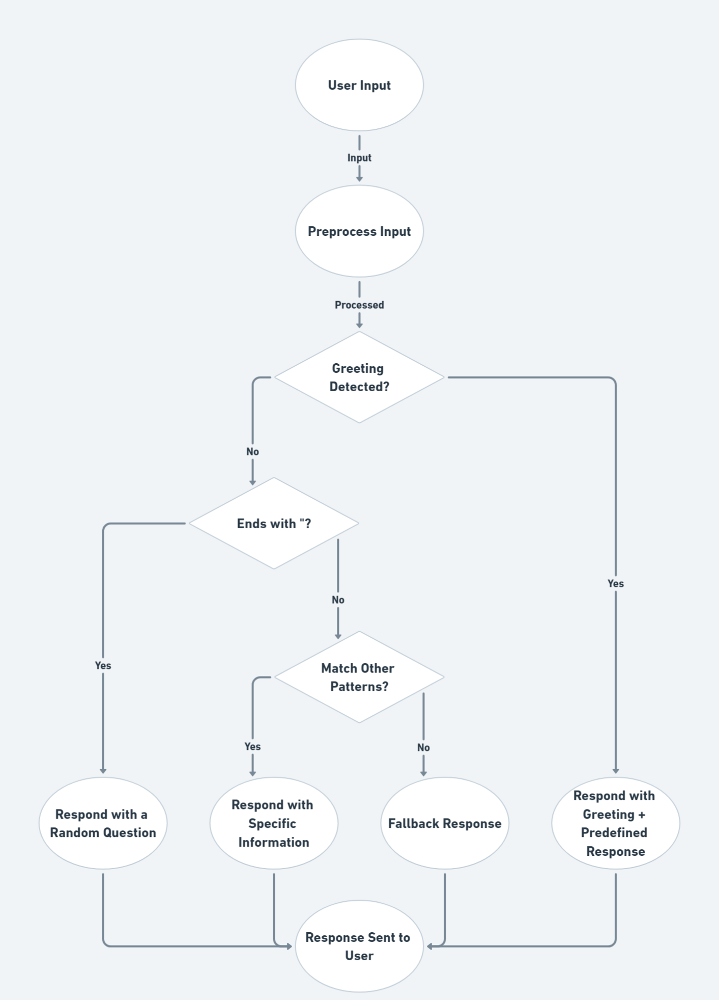
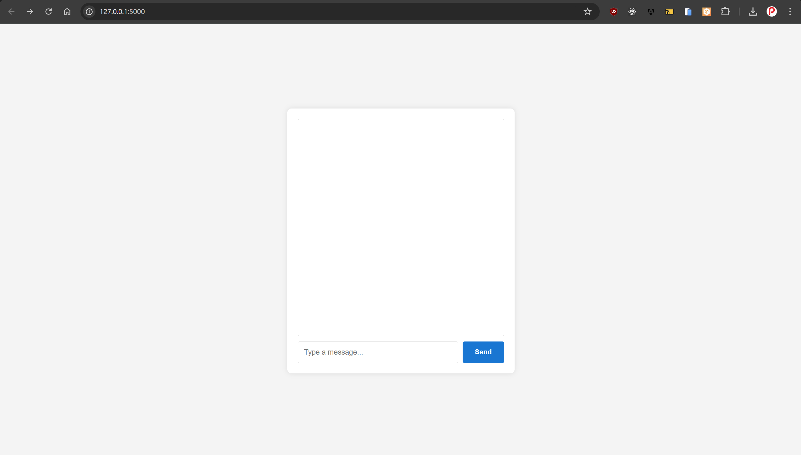
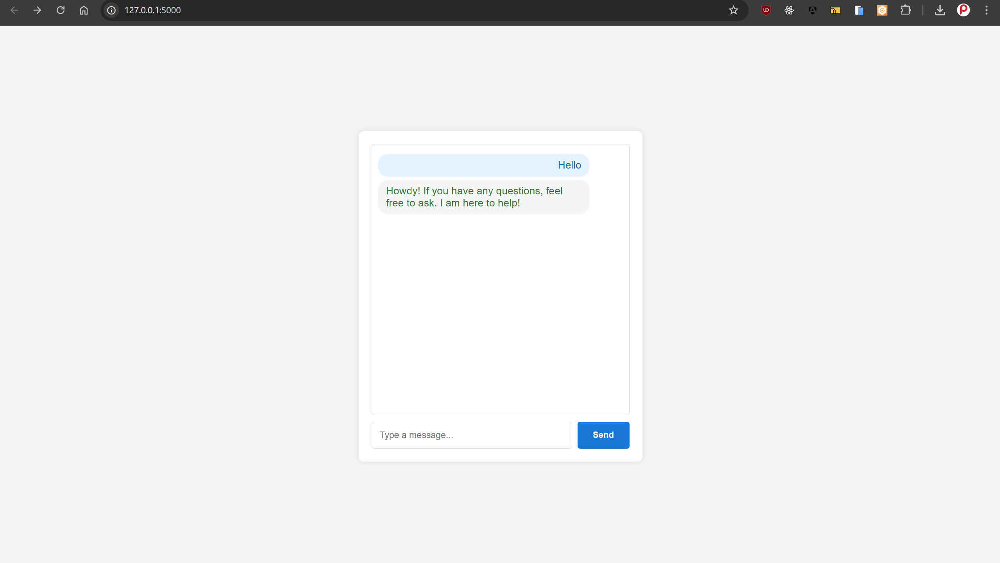
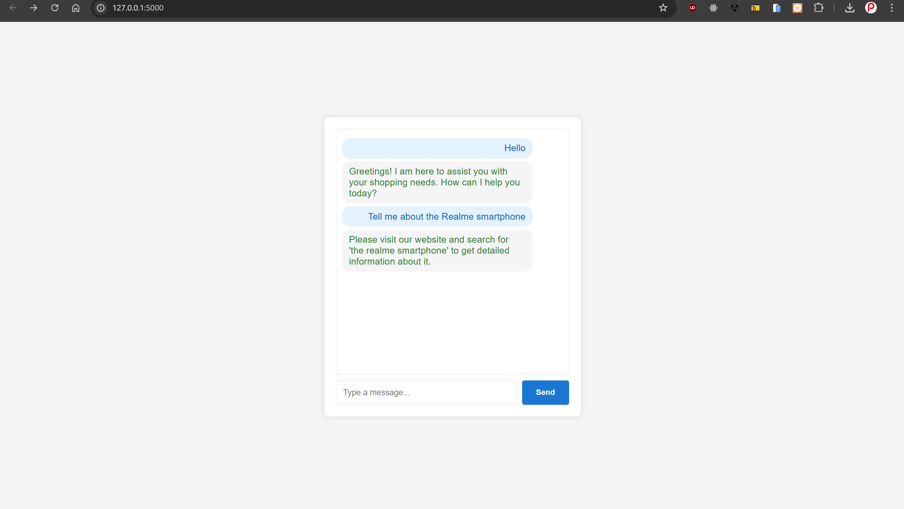
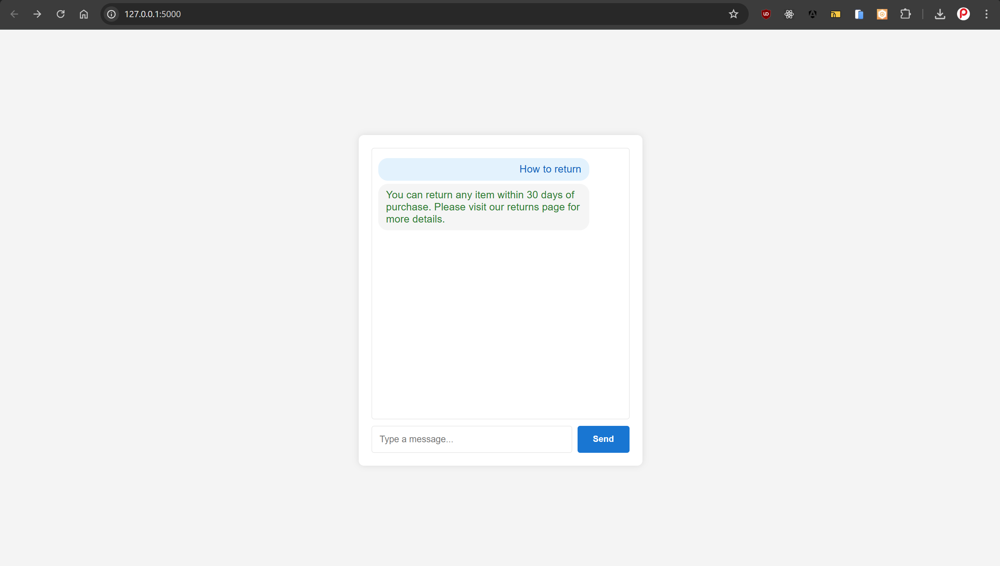
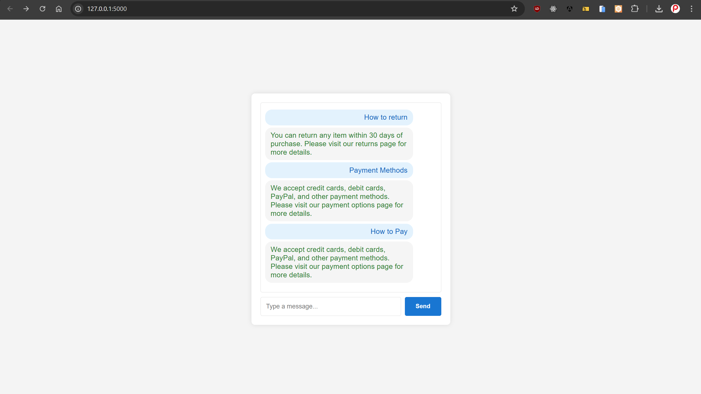

# ShopBot

ShopBot is a simple chatbot designed to assist customers with their shopping needs on an e-commerce website. It can respond to various queries related to orders, products, payment methods, and more.

## Features

- Greets users and offers assistance.
- Responds to questions about order status, return policies, payment methods, and product details.
- Provides information about shipping, discounts, customer reviews, new arrivals, best sellers, and more.
- Handles common customer service queries.

## Flow Chart Of the Chat Bot


## Screenshots

### Chatbot Homepage


### Chatbot Response for a Greeting


### Chatbot Response to a Product Query


### Chatbot Response to "How to Return" or "Return Item" Query


### Chatbot Response to "Payment Methods" or "How to Pay" Query


## Installation

1. Clone the repository:
    ```sh
    git clone https://github.com/ParasSalunke/Implementation-of-Chatbot-Using-NLP.git
    ```
2. Navigate to the project directory:
    ```sh
    cd Implementation-of-Chatbot-Using-NLP
    ```
3. Ensure you have Python installed. ShopBot requires Python 3.6 or higher.

## Usage

1. Run the `app.py` script:
    ```sh
    python app.py
    ```
2. Open your web browser and navigate to `http://127.0.0.1:5000/`.
3. Interact with ShopBot by typing your queries in the chat interface.

## Code Overview

### `ShopBot` Class

The `ShopBot` class encapsulates the chatbot's behavior and data.

#### Methods

- `__init__(self)`: Initializes the chatbot with predefined greetings, questions, and responses.
- `get_response(self, user_input)`: Processes the user input and returns an appropriate response.
- `match_greeting(self, user_input)`: Checks if the user input contains a greeting.
- `match_patterns(self, user_input)`: Matches user input against predefined patterns and generates appropriate responses.

### Flask Routes

- `index()`: Renders the main chat interface.
- `chat()`: Handles chat messages sent by the user and returns a response from the chatbot.

## Extending ShopBot

To add more patterns and responses, modify the `patterns` list in the `match_patterns` method. Each pattern is a tuple containing a regular expression and a response. The response can be a string or a lambda function that takes a match object as an argument.

Example:
```python
patterns = [
    (r'example pattern', "Example response."),
    (r'example (.+)', lambda match: f"Example response with {match.group(1)}.")
]